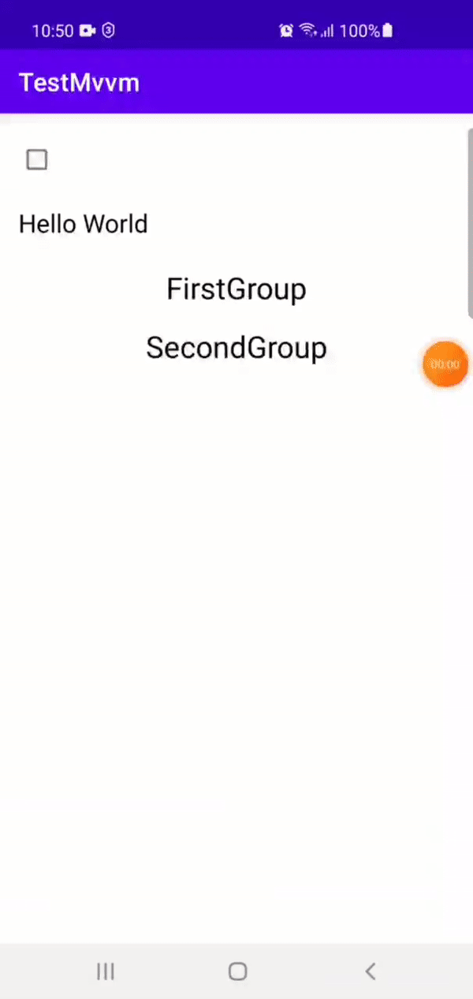

# mvvmcore


Lib was created for faster start in MVVM architecture.

There are introduced 3 base mvvm abstraction Activity, Fragment and FragmentDialog.

You can also find a specific RVAdapter for faster programming logic connected with RecycleView and binding.

Let's do some practice.

Add dependencies

Add into project build.gradle or settings.gradle

```
allprojects {
	repositories {
		...
		maven { url 'https://jitpack.io' }
	}
}
```

Add into app build.gradle

```
dependencies {
	implementation 'com.github.anbazhan.mvvmcore:final:VERSION'
}
```
Add databinding into your project

```
buildFeatures {
   dataBinding = true
}
```

Create a simple ViewModel

```kotlin
class MyViewModel : BaseActivityViewModel() {

   val isChecked: MutableLiveData<Boolean> = MutableLiveData(false)

   val text = Transformations.map(isChecked) {
       if (it) {
           "Goodbye World"
       } else {
           "Hello World"
       }
   }
}
```

Examples connected with activity, but other components work the same way.

Create a simple xml

```xml
<?xml version="1.0" encoding="utf-8"?>
<layout xmlns:android="http://schemas.android.com/apk/res/android"
   xmlns:app="http://schemas.android.com/apk/res-auto"
   xmlns:tools="http://schemas.android.com/tools">

   <data>

       <variable
           name="viewModel"
           type="ru.morizo.testmvvm.MyViewModel" />

   </data>

   <androidx.constraintlayout.widget.ConstraintLayout
       android:layout_width="match_parent"
       android:layout_height="match_parent">

       <Switch
           android:id="@+id/my_switch"
           android:layout_width="wrap_content"
           android:layout_height="wrap_content"
           android:layout_marginStart="16dp"
           android:layout_marginTop="16dp"
           android:checked="@={viewModel.isChecked()}"
           app:layout_constraintStart_toStartOf="parent"
           app:layout_constraintTop_toTopOf="parent" />

       <TextView
           android:id="@+id/my_text"
           android:layout_width="wrap_content"
           android:layout_height="wrap_content"
           android:layout_marginStart="16dp"
           android:layout_marginTop="16dp"
           android:text="@{viewModel.text}"
           android:textColor="@color/black"
           android:textSize="20sp"
           app:layout_constraintLeft_toLeftOf="parent"
           app:layout_constraintTop_toBottomOf="@id/my_switch"
           tools:text="Hello World!" />

   </androidx.constraintlayout.widget.ConstraintLayout>

</layout>
```

And last step create Activity

```kotlin
class MainActivity : BaseActivity<MyViewModel, ActivityMainBinding>() {

   override val layoutIdRes: Int = R.layout.activity_main
   override val viewModelBRVarId: Int = BR.viewModel

   // You can also provide it with DI or use any way you need
   override val viewModel: MyViewModel by lazy {
       MyViewModel()
   }
}
```

You can use livedata for observing your component using method observeViewModel

```kotlin
override fun observeViewModel() {
   super.observeViewModel()
  
   viewModel.isChecked.observe(this) {
       // SomeLogic
   }
}
```

And you can use the binding field for communicating with view.

```kotlin
binding.myText.text
```
Library also contains a realization for RecyclerView Adapter which works with binding using mvvm architecture.

For better understanding, let’s create our own expanded adapter

But first let’s create a generic interface. It will be used to provide header and item the same way.
```kotlin
interface MyItem
```

Create simple data classes.
```kotlin
data class Item(val text: String)
```
```kotlin
data class Header(val text: String, val itemList: List<Item>)
```

Create wrapper for this classes which we will use in our logic

```kotlin
class ItemWrapper(val item: Item) : MyItem
```

For header it will be more complex class
```kotlin
class HeaderWrapper(
   val header: Header,
   val onClick: (headerWrapper: HeaderWrapper, List<BindingItem<ItemWrapper>>) -> Unit
) : MyItem {

   private val bindingItems = header.itemList.map {
       BindingItem(
           BR.item,
           R.layout.item_second,
           ItemWrapper(it)
       )
   }

   fun click() {
       onClick(this, bindingItems)
   }
}
```

There is a specific class BindingItem. It is used for binding items with layout. 
Let’s create xml files for our items

first.xml
```xml
<layout xmlns:android="http://schemas.android.com/apk/res/android"
   xmlns:app="http://schemas.android.com/apk/res-auto"
   xmlns:tools="http://schemas.android.com/tools">

   <data>

       <variable
           name="item"
           type="ru.morizo.testmvvm.items.HeaderWrapper" />

   </data>

   <androidx.constraintlayout.widget.ConstraintLayout
       android:layout_width="match_parent"
       android:layout_height="wrap_content"
       android:onClick="@{() -> item.click()}">

       <TextView
           android:layout_width="match_parent"
           android:layout_height="wrap_content"
           android:gravity="center"
           android:paddingVertical="8dp"
           android:text="@{item.header.text}"
           android:textColor="@color/black"
           android:textSize="24sp"
           app:layout_constraintTop_toTopOf="parent"
           tools:text="text" />

   </androidx.constraintlayout.widget.ConstraintLayout>

</layout>
```
second.xml
```xml
<layout xmlns:android="http://schemas.android.com/apk/res/android"
   xmlns:app="http://schemas.android.com/apk/res-auto"
   xmlns:tools="http://schemas.android.com/tools">

   <data>

       <variable
           name="item"
           type="ru.morizo.testmvvm.items.ItemWrapper" />

   </data>

   <androidx.constraintlayout.widget.ConstraintLayout
       android:layout_width="match_parent"
       android:layout_height="wrap_content">

       <TextView
           android:layout_width="match_parent"
           android:layout_height="wrap_content"
           android:paddingVertical="8dp"
           android:text="@{item.item.text}"
           android:textColor="@color/black"
           android:textSize="18sp"
           app:layout_constraintTop_toTopOf="parent"
           tools:text="text" />

   </androidx.constraintlayout.widget.ConstraintLayout>

</layout>
```

Now we should modify our ViewModel
```kotlin
val items: MutableLiveData<MutableList<BindingItem<MyItem>>> = MutableLiveData(mutableListOf())
…
override fun onCreate(owner: LifecycleOwner) {
   super.onCreate(owner)
   items.value = items.value?.apply {
       addAll(
           mutableListOf(
               Header("FirstGroup", listOf(Item("first"), Item("second"))),
               Header("SecondGroup", listOf(Item("first"), Item("second"), Item("third")))
           ).map {
               BindingItem(
                   BR.item,
                   R.layout.item_first,
                   HeaderWrapper(
                       it,
                   ) { header, items ->
                       onHeaderClick(header, items as List<BindingItem<MyItem>>)
                   }
               )
           }
       )
   }
}

fun onHeaderClick(header: HeaderWrapper, list: List<BindingItem<MyItem>>) {
   items.value?.indexOfFirst { it.item == header }?.let { position ->
       items.value = items.value?.apply {
           if (this.containsAll(list)) {
               removeAll(list)
           } else {
               addAll(position + 1, list)
           }
       }
   }
}
```

You can provide your own logic for expanding items. It is just an example.

Add RecyclerView in our activity layout.
```xml
<androidx.recyclerview.widget.RecyclerView
   android:id="@+id/rv"
   android:layout_width="match_parent"
   android:layout_height="0dp"
   android:items="@{viewModel.items}"
   app:layoutManager="androidx.recyclerview.widget.LinearLayoutManager"
   app:layout_constraintBottom_toBottomOf="parent"
   app:layout_constraintTop_toBottomOf="@id/my_text" />
```

You can find that android:items is a simple extension function for RecyclerView. You can provide your own logic for notifying your adapter.

And last step modify our activity
```kotlin
override fun onCreate(savedInstanceState: Bundle?) {
   super.onCreate(savedInstanceState)
   binding.rv.adapter = BaseRVAdapter<MyItem, BindingItem<MyItem>>()
}
```




